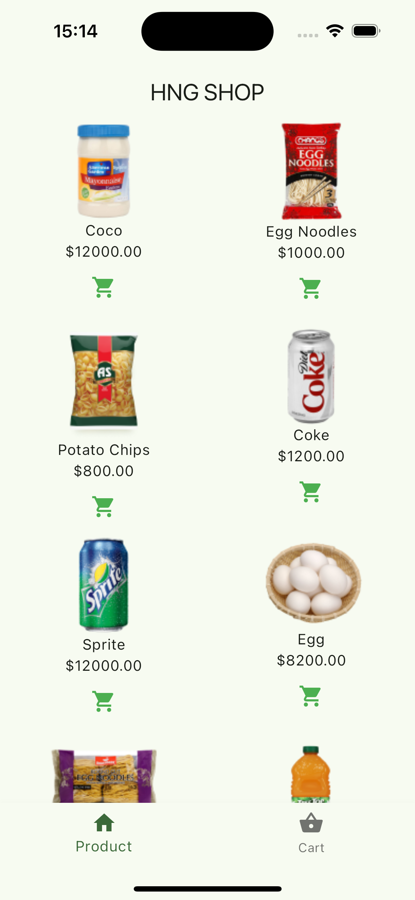
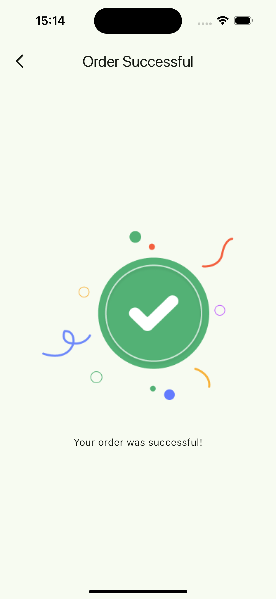
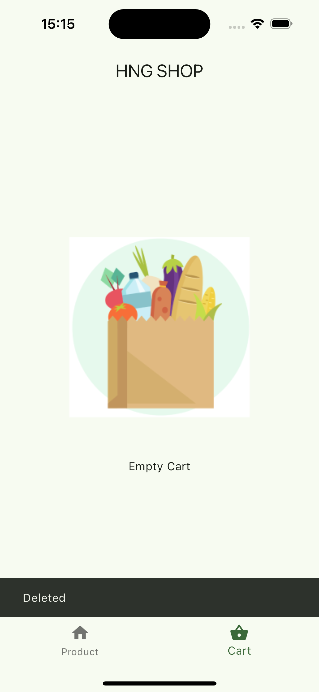
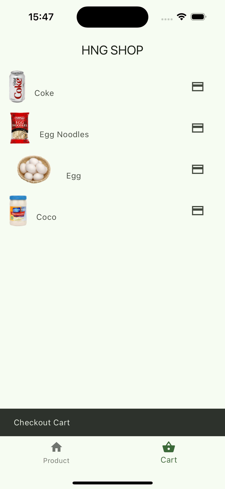

# SIMPLE SHOPPING APP

This is an assignment report for the HNG stage one task. I was tasked to develop a simple shopping app without third-party Api and packages that have two menus which are product and cart.

# Features

- List of Product(Static)
- Add and remove products from the cart list.
- Navigate to the order successful screen from the cart screen.
- No third-parties

# Screenshots
<b>Product Screen</b>

<b>Successful Order Screen</b>

<b>Empty Cart Screen</b>

<b>Cart Screen</b>

# Appetize Demo

- you can view the app on Appetize.io{}

# Project Structure

# Coode Overview

# Models
# Widgets
- Product Item Widget (lib/widgets/product_item.dart): Represents a single product item in the list.
# Screens
- Products Screen (lib/screens/products_screen.dart): Displays a list of products.
- Checkout Screen (lib/screens/checkout_screen.dart): Displays the products added for checkout and a button to navigate to the order successful screen.
- Order Successful Screen (lib/screens/order_successful_screen.dart): Displays a message confirming the order.

# Main file
- Main file (lib/main.dart): Contains the main entry point of the app, sets up navigation
